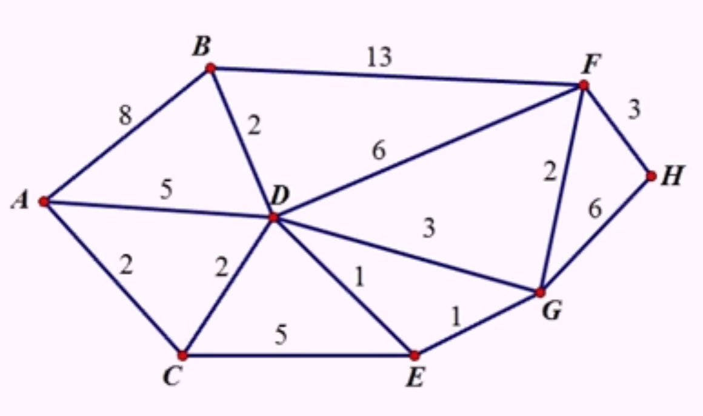

# SimpleDijkstra
This simple implementation of [Dijkstra's shortest path algorithm](https://en.wikipedia.org/wiki/Dijkstra%27s_algorithm) for Node was made to be lightweight and without any dependency.

## Motivations
The first motivation was to check how tricky it was to code. Otherwise, most of the time, I don't really need such algorithm. A lot of libraries and [implementations](https://www.quora.com/What-is-the-most-simple-efficient-C++-code-for-Dijkstras-shortest-path-algorithm) just give the shortest *weight* (aka. distance) without giving the list of vertice that compose this shortest path. In my opinion, knowing that the shortest road from Paris to Moscow is 2835km won't help me so much if I don't know what is the next city I am supposed to follow.

Anyway, I didn't want to be influenced by other pieces of code, so I decided to use only this [Youtube video](https://www.youtube.com/watch?v=5GT5hYzjNoo) to create **SimpleDijkstra**. 

<iframe width="560" height="315" src="https://www.youtube.com/embed/5GT5hYzjNoo" frameborder="0" allowfullscreen></iframe>

## How to install it
### Browser
In a browser, you just have to import the javascript file, like in the example given in `tests/browser.index.html`:
```html
<html xmlns="http://www.w3.org/1999/xhtml">
    <head>
        <script src="SimpleDijkstraGraph.js"></script>
        <script src="SimpleDijkstra.js"></script>
        ...
```

### Server
Depending on where you place the **SimpleDijkstra** folder, you will have to import:

```js
var SimpleDijkstraGraph = require("path/to/SimpleDijkstra").SimpleDijkstraGraph;
var SimpleDijkstra = require("path/to/SimpleDijkstra").SimpleDijkstra;

```

Of if you have **SimpleDijkstra** in your `node_modules` directory, simply:
```js
var SimpleDijkstraGraph = require("SimpleDijkstra").SimpleDijkstraGraph;
var SimpleDijkstra = require("SimpleDijkstra").SimpleDijkstra;
```

## How to use
*(this is browser/server independant)*  
First, you need to create a *graph*, here, it is called **SimpleDijkstraGraph**:

```js
var g = new SimpleDijkstraGraph();
```

Then, you need to add some vertice. This is actually done by adding a *edge*. A edge is always composed of two distinct vertice, with a non-zero distance between them. Following this graph:



The edge declaration is as follow:

```js
// creating the graph
var g = new SimpleDijkstraGraph();

// from a
g.addEdge("a", "b", 8);
g.addEdge("a", "d", 5);
g.addEdge("a", "c", 2);
// from b
g.addEdge("b", "d", 2);
g.addEdge("b", "f", 13);
// from c
g.addEdge("c", "d", 2);
g.addEdge("c", "e", 5);
// from d
g.addEdge("d", "e", 1);
g.addEdge("d", "f", 6);
g.addEdge("d", "g", 3);
// from e
g.addEdge("e", "g", 1);
// from f
g.addEdge("f", "g", 2);
g.addEdge("f", "h", 3);
// from g
g.addEdge("g", "h", 6);
```

You may have noticed it is neither necessary to declare the distance *both ways*, nor the distance from each vertex to themselves (that would be 0).

Then, create a **SimpleDijkstra** instance and run the algorithm:

```js
/*
    The 2 steps way
*/
var dij1 = new SimpleDijkstra(g);
// step1: getting the short distances to all other vertice
dij1.runDijkstra("b");

// step 2: retrieving the shortest path from the starting vertex to another
var path = dij1.getShortestPathTo("h");
```

Or in one single shot:

```js
/*
    The 1 step way
*/
var dij2 = new SimpleDijkstra(g);
var path = dij2.getShortestPathFromTo("b", "h");
```

In both case, *path* is like that:
```js
{
    d: 9,  // stands for distance between b and h
    vertice: ["b", "d", "e", "g", "f", "h"]
}
```


## Alternatives
The [Graphlib](https://github.com/cpettitt/graphlib) project by [Chris Pettitt](https://github.com/cpettitt) is an advanced library for playing with graph, and it contains a [Dijkstra algorithm](https://github.com/cpettitt/graphlib/wiki/API-Reference#alg-dijkstra) in the *alg* section.

## License
MIT
